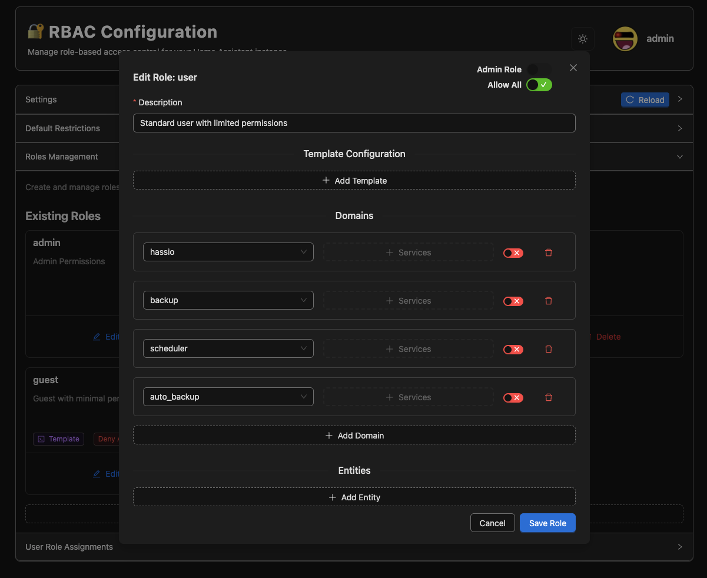
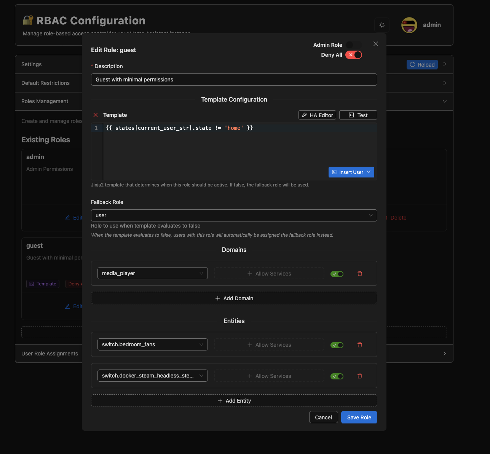
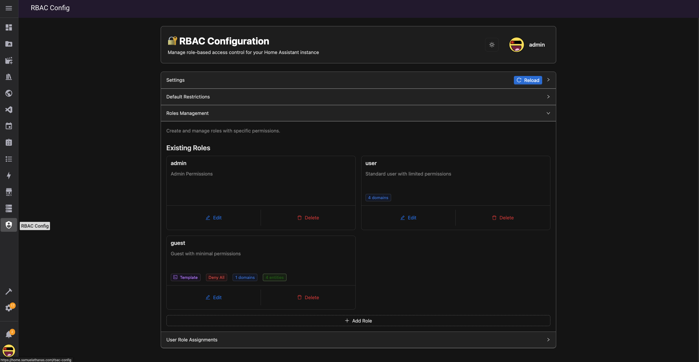
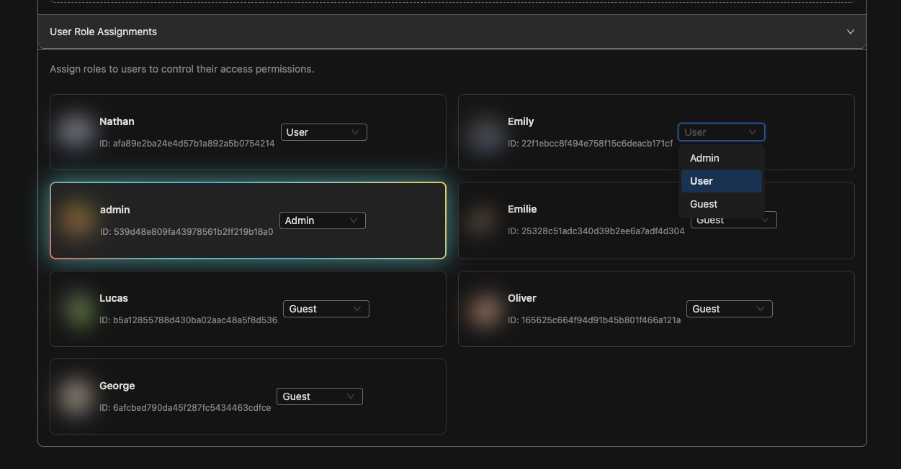
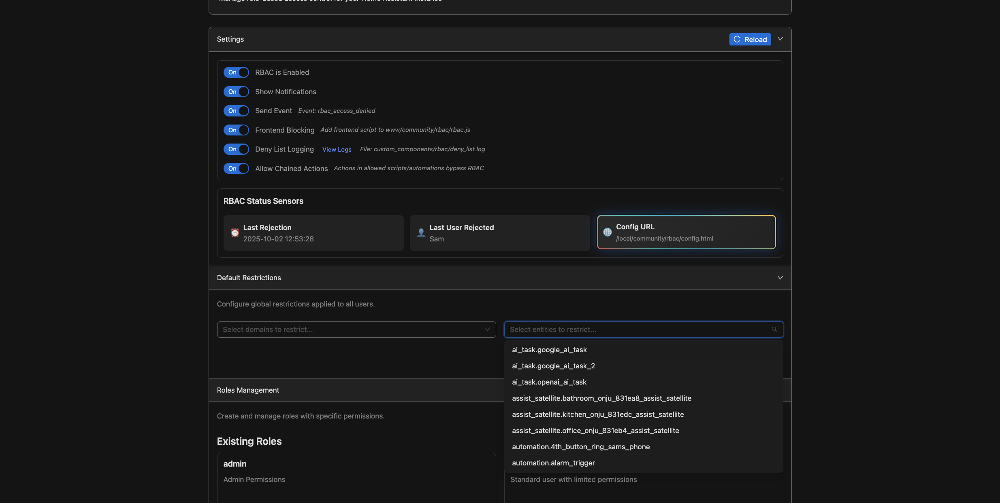
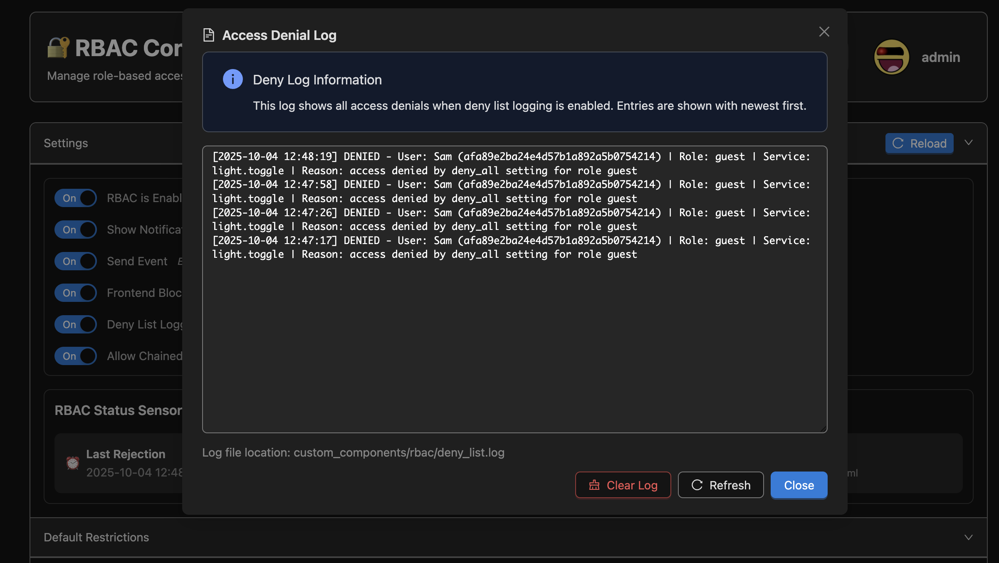

  

<h1 align="center">🏠 Home Assistant RBAC Middleware</h1>

  Finally, a flexible Role-Based Access Control (RBAC) middleware component for Home Assistant that intercepts service calls and enforces access control based on YAML configuration. 
  There is also a friendly frontend GUI as an alternative to configuring the YAML directly.

## 📸 Gallery

  <table>
    <tr>
      <td align="center">
        
         <strong>Role Editing</strong>
         <em>Detailed role configuration and permission settings</em>
      </td>
      <td align="center">
        
         <strong>Guest Role Configuration</strong>
         <em>Specialized role setup for guest users</em>
      </td>
    </tr>
    <tr>
      <td align="center">
        
         <strong>Role Management</strong>
         <em>Overview of all configured roles and their settings</em>
      </td>
      <td align="center">
        
         <strong>User Role Assignment</strong>
         <em>Assigning roles to Home Assistant users</em>
      </td>
    </tr>
    <tr>
      <td align="center">
        
         <strong>Settings and Default Restrictions</strong>
         <em>System-wide settings and default access controls</em>
      </td>
      <td align="center">
        
         <strong>Deny Log</strong>
         <em>Track and monitor denied access attempts</em>
      </td>
    </tr>
  </table>

## ⚠️ Notice:
This application is under active development and is not stable yet!
Its ideal for users who want to experiment with basic role based access, and restrict others from being able to call specific actions on your home server. (Perhaps this will finally put an end to people expoiting the search feature or widgets to call actions that are not on your dashboard!) This component has been tested on my own instance quite a bit, but there will likely be some bugs that remain. Feel free to contribute directly or raise an issue if there is something you would like tweaked.

Due to the nature of this application patching core functions, its possible that it will break in future updates of home assistant. If this occurs, you may disable the component until its updated to work with the latest version. Disabling the component will cause home assistant to return back to its normal state, without any of the rbac blocking features.

## ✨ Features
- **Service Call Interception**: Automatically intercepts all Home Assistant service calls.
- **YAML-Based Configuration**: Ability to define access control rules in a YAML file.
- **Modernized Frontend for Configuration**: Alternatively use the admin frontend to configure the access control rules.
- **Domain and Entity Level Control**: Restrict access at both domain and entity levels.
- **Action/Service call Control**: Restrict actions on specific domains or entities, or restrict all actions tied to an entity.
- **Allow All and Deny All settings supported**: Configure roles to allow everything, with specific blocked entities or block everything, with specific allowed entities.
- **Frontend Blocking**: Remove blocked entities from the native HA quickbar
- **Dynamic Configuration**: Reload configuration without restarting Home Assistant
- **Notifications+Events**: Persistant notifications and events are sent when system denies action call.
- **Service Management**: Built-in services to manage and inspect configuration.
- **Deploy Scripts for Development**: vs-code scripts included to auto ssh into server to copy files based on .env variables, and auto restarts HA after deployment for streamlined dev workflow.

## 🚀 Installation
- Copy the files to your server first
  - Component: custom_components/rbac
  - Frontend: www/community/rbac
  - Frontend Script (Add to resources, Javascript Module): /local/community/rbac/rbac.js
- OR utilize the deploy.sh script to deploy to your instance directly. this requires setting up a .env file in the root of this project to configure your ssh settings
- Search for the 'RBAC' (Role Based Access Control) Integration and install it
- Ensure you are logged in as an admin user, and then access this page <YOUR_HA_DOMAIN>/local/community/rbac/config.html
- Configure Roles and Role Assignments
- Changes to the config take effect immediantly without any restart needed
- Test with users to ensure denied action calls are blocked

## 💡 Creative Ideas
- Restrict non household users to sensitive domains like 'light', 'camera', or home assistant shutdown services
- Create a guest role that utilizes the current user context in a template to determine if they should have access to your homes entities based on if they are within proximity of your house ('Guest' role is used when they are not at 'home', 'User' role is used if they are at home) {{ states[current_user_str].state != 'home'}}

## 📝 Notes
- Admin users or users assigned an admin role will be able to access the RBAC configuration page 
- Its possible to assign templates to each role. Templates will be evaluated each time a user that has that role executes a service call. The template will determine if the users role should be used, or if it should fallback to a different role with an entierly different set of permissions. This makes it possible to create more complex auth systems based on current states from your HA instance.
- Default domain/enttiy blocklists are supported. Any non-admin user will always have these restrictions enforced.
- Frontend is built using Preact that compiles into a static page, for easier state management and component isolation.

## 🤝 Contributing
Contributions are welcome and much appreciated!
There are vscode scripts included to easily deploy changes made to the backend or frontend, and auto retart HA when complete.

1. Fork the repository
2. Create a feature branch
3. Make your changes
4. Test thoroughly
5. Submit a pull request

Alternatively, you may submit an issue if you encounter a problem or want to request a new feature.

## 📄 License
This project is licensed under the MIT License.
